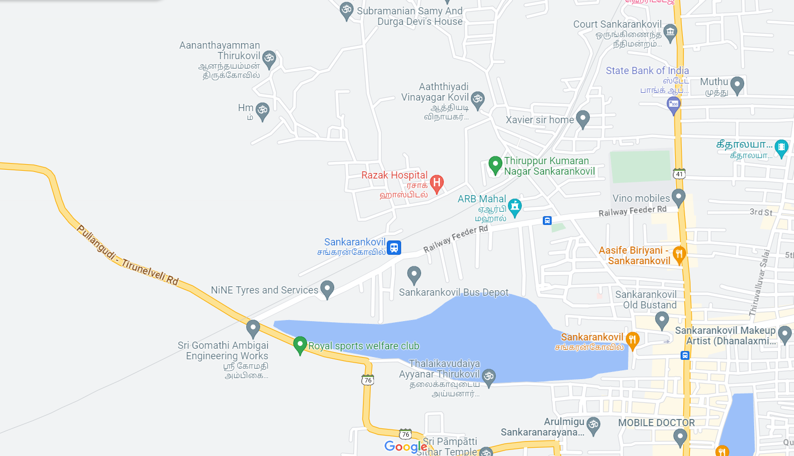
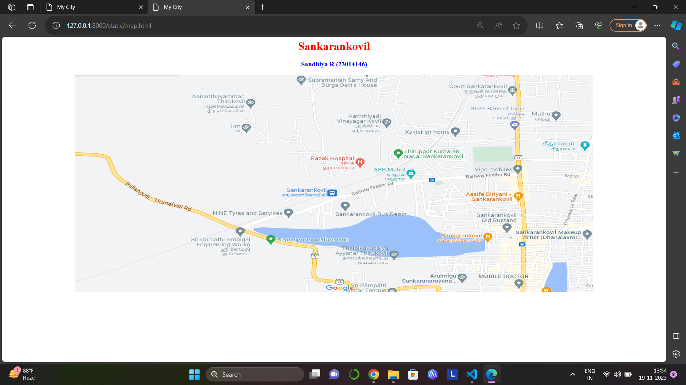
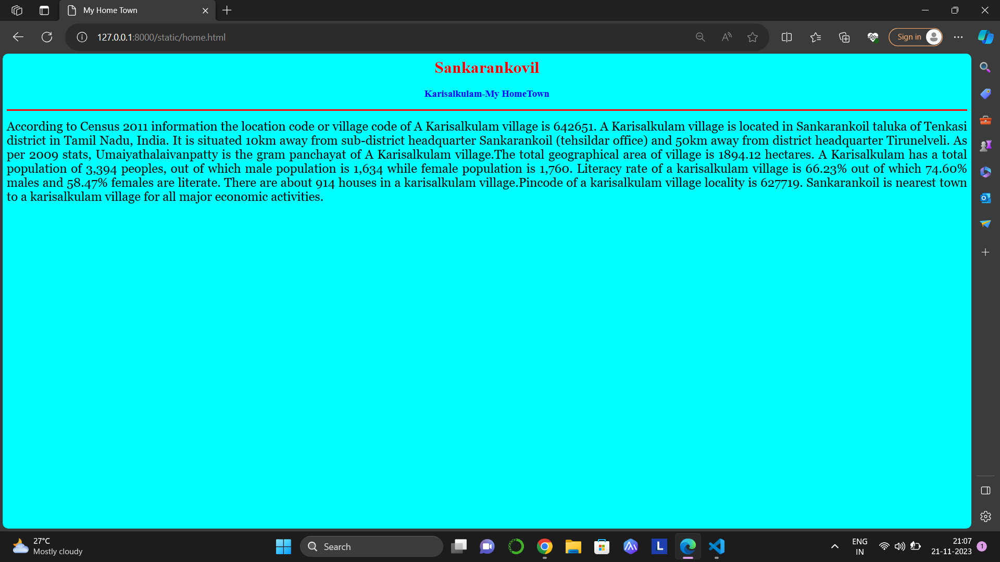
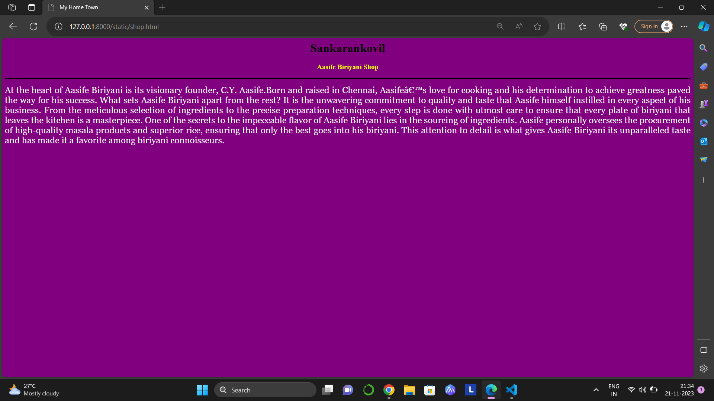
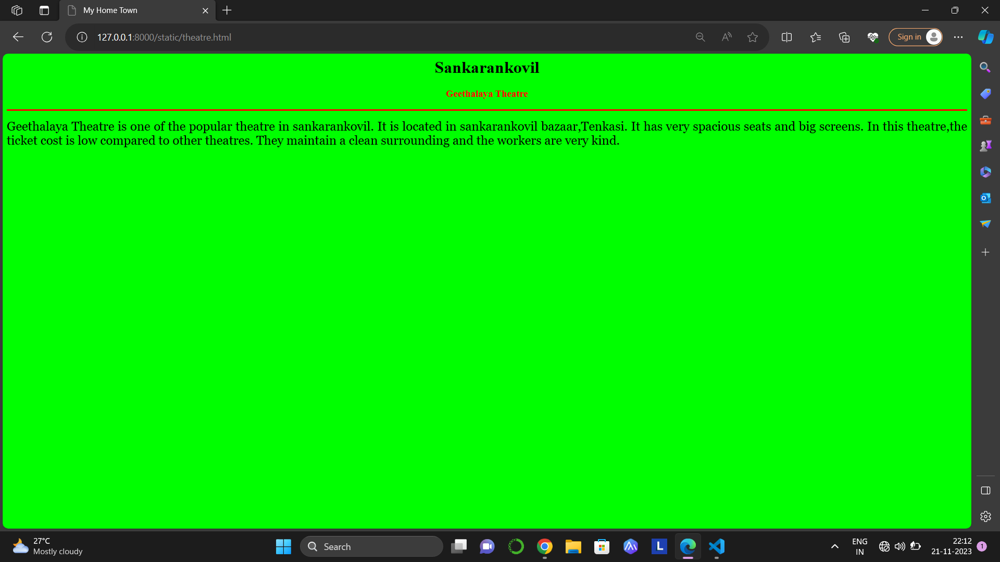

# Ex04 Places Around Me
## Date: 20.11.2023

## AIM
To develop a website to display details about the places around my house.

## DESIGN STEPS

### STEP 1
Create a Django admin interface.

### STEP 2
Download your city map from Google.

### STEP 3
Using ```<map>``` tag name the map.

### STEP 4
Create clickable regions in the image using ```<area>``` tag.

### STEP 5
Write HTML programs for all the regions identified.

### STEP 6
Execute the programs and publish them.

## CODE
```
map.html
<html>
    <head>
        <title>My City</title>
    </head>
    <body>
        <h1 align="center">
            <font color="red"><b>Sankarankovil</b></font>
        </h1>
        <h3 align="center">
            <font color="blue"><b>Sandhiya R (23014146)</b></font>
        </h3>
        <center>
            
            <map name="MyCity">
                <area shape="rect" coords="650,300,700,350" href="home.html"title="MyHomeTown">
                <area shape="rect" coords="750,300,850,400" href="bus.html"title="BusDepot">
                <area shape="circle" coords="1143,436,111" href="shop.html"title="AasifeBriyani">
                <area shape="circle" coords="872,371,95" href="mahal.html"title="ARBMahal">
                <area shape="rect" coords="1282,200,1425,150" href="theatre.html"title="GeethalayaTheatre">
            </map>
        </center>
    </body>
</html>

home.html
<html>
    <head>
        <title>My Home Town</title>
    </head>
        <body bgcolor="cyan">
            <h1 align="center">
            <font color="red"><b>Sankarankovil</b></font>
            </h1>
            <h3 align="center">
            <font color="blue"><b>Karisalkulam-My HomeTown</b></font>      
            </h3>
            <hr size="3" color="red">
            <p align="justify">
                <font face="Georgia" size="5">
                    According to Census 2011 information the location code or village code of A Karisalkulam village is 642651. 
                    A Karisalkulam village is located in Sankarankoil taluka of Tenkasi district in Tamil Nadu, India.
                    It is situated 10km away from sub-district headquarter Sankarankoil (tehsildar office) and 50km away from district headquarter Tirunelveli.
                    As per 2009 stats, Umaiyathalaivanpatty is the gram panchayat of A Karisalkulam village.The total geographical area of village is 1894.12 hectares.
                    A Karisalkulam has a total population of 3,394 peoples, out of which male population is 1,634 while female population is 1,760.
                    Literacy rate of a karisalkulam village is 66.23% out of which 74.60% males and 58.47% females are literate.
                    There are about 914 houses in a karisalkulam village.Pincode of a karisalkulam village locality is 627719.
                    Sankarankoil is nearest town to a karisalkulam village for all major economic activities.
                </font>
            </p>
    </body>
</html>

bus.html
<html>
    <head>
        <title>My Home Town</title>
    </head>
        <body bgcolor="yellow">
            <h1 align="center">
            <font color="red"><b>Sankarankovil</b></font>
            </h1>
            <h3 align="center">
            <font color="blue"><b>Sankarankovil Bus Depot</b></font>      
            </h3>
            <hr size="3" color="red">
            <p align="justify">
                <font face="Georgia" size="5">
                    A depot is a transport system’s operating base. It provides parking accommodation, servicing and maintenance facilities for vehicles, an administrative function, and facilities for staff. 
                    A fully enclosed depot is sometimes referred to as a garage. An operator may have one depot or several, depending on its fleet size or geographic coverage. 
                    Most transport operators have their head offices at one of their depots. Operators with fleets of more than two or three vehicles should have the use of off-street depot facilities. 
                    A small operator will normally have facilities for only very basic servicing. The larger the operator, the greater is the scope for carrying out maintenance work in-house at the depot.
                    
                    The principal operational tasks to be carried out at a bus depot are:
                    
                    Allocating buses and crews to each duty.
                    Dispatching buses according to schedule.
                    Processing cash paid in by conductors or drivers.   
                </font>
            </p>
    </body>
</html>

shop.html
<html>
    <head>
        <title>My Home Town</title>
    </head>
        <body bgcolor="purple">
            <h1 align="center">
            <font color="black"><b>Sankarankovil</b></font>
            </h1>
            <h3 align="center">
            <font color="yellow"><b>Aasife Biriyani Shop</b></font>      
            </h3>
            <hr size="3" color="black">
            <p align="justify">
                <font face="Georgia" size="5" color="white">
                    At the heart of Aasife Biriyani is its visionary founder, C.Y. Aasife.Born and raised in Chennai, Aasife’s love for cooking and his determination to achieve greatness paved the way for his success.
                    What sets Aasife Biriyani apart from the rest? It is the unwavering commitment to quality and taste that Aasife himself instilled in every aspect of his business. 
                    From the meticulous selection of ingredients to the precise preparation techniques, every step is done with utmost care to ensure that every plate of biriyani that leaves the kitchen is a masterpiece.
                    One of the secrets to the impeccable flavor of Aasife Biriyani lies in the sourcing of ingredients. Aasife personally oversees the procurement of high-quality masala products and superior rice, ensuring that only the best goes into his biriyani. 
                    This attention to detail is what gives Aasife Biriyani its unparalleled taste and has made it a favorite among biriyani connoisseurs.
                </font>
            </p>
    </body>
</html>

mahal.html
<html>
    <head>
        <title>My Home Town</title>
    </head>
        <body bgcolor="pink">
            <h1 align="center">
            <font color="black"><b>Sankarankovil</b></font>
            </h1>
            <h3 align="center">
            <font color="red"><b>ARB Mahal</b></font>      
            </h3>
            <hr size="3" color="red">
            <p align="justify">
                <font face="Georgia" size="5">
                    ARB Mahal listed under Banquet Halls in Railway Feeder Road,Sankarankovil,Tenkasi.
                    Banquet Halls is an enclosed space suitable for hosting a variety of events such as birthday parties,corporate events,engagement ceremonies,weddings,receptions.
                    They are beautifully designed and decorated to create an elegant ambience for any event you are hosting.
                    ARB Mahal in Railway Feeder Road is one of the most trustworthy names in the field.
                    They have received a 4.2 rating from their customers,the accept multiple modes of payment such as cash.
                </font>
            </p>
    </body>
</html>

theatre.html
<html>
    <head>
        <title>My Home Town</title>
    </head>
        <body bgcolor="lime">
            <h1 align="center">
            <font color="black"><b>Sankarankovil</b></font>
            </h1>
            <h3 align="center">
            <font color="red"><b>Geethalaya Theatre</b></font>      
            </h3>
            <hr size="3" color="red">
            <p align="justify">
                <font face="Georgia" size="5">
                    Geethalaya Theatre is one of the popular theatre in sankarankovil.
                    It is located in sankarankovil bazaar,Tenkasi.
                    It has very spacious seats and big screens.
                    In this theatre,the ticket cost is low compared to other theatres.
                    They maintain a clean surrounding and the workers are very kind. 
                </font>
            </p>
    </body>
</html>
```

## OUTPUT







## RESULT
The program for implementing image maps using HTML is executed successfully.
